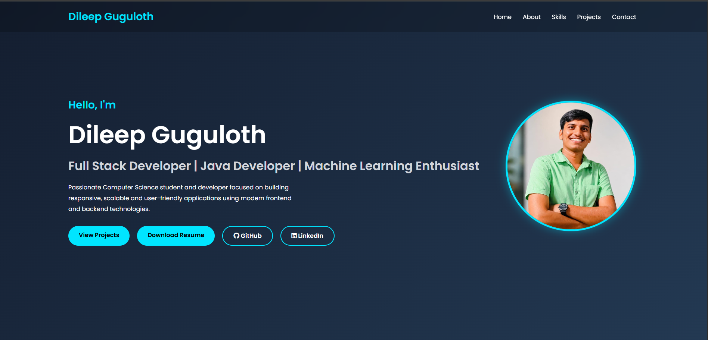
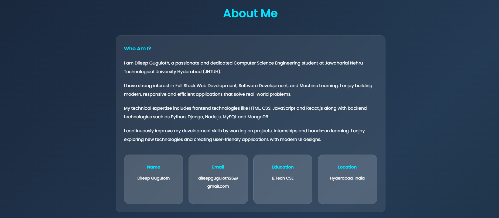
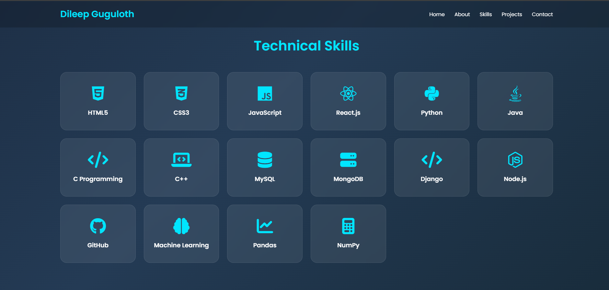
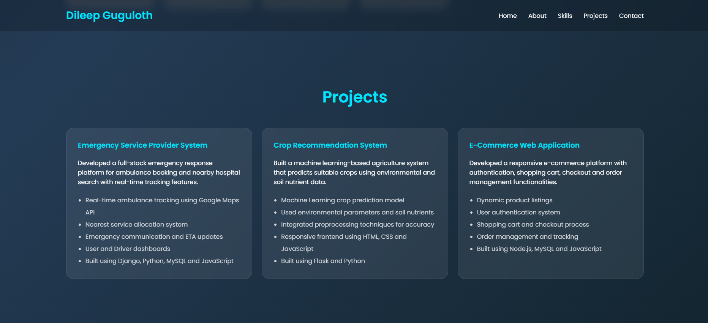

# 🌐 Personal Portfolio Website

A modern and fully responsive personal portfolio website developed as part of the **Synent Technologies Web Development Internship Program**.

This portfolio showcases my profile, technical skills, projects, education details, resume, and contact information with a clean and professional user interface.

---

# 🚀 Features

## 🏠 Home Section

- Professional introduction
- Profile picture
- Resume download option
- GitHub profile link
- LinkedIn profile link
- Responsive navigation menu

## 👨‍💻 About Me Section

- Personal introduction
- Educational background
- Career objective
- Professional summary

## 🛠️ Technical Skills Section

### Frontend

- HTML5
- CSS3
- JavaScript
- React.js

### Backend

- Node.js
- Django

### Programming Languages

- Java
- Python
- C
- C++

### Database

- MySQL
- MongoDB

### Other Skills

- GitHub
- Machine Learning
- Pandas
- NumPy

## 📂 Projects Section

### Emergency Service Provider System

- Ambulance booking platform
- Real-time tracking
- Hospital search
- User and Driver dashboards

### Crop Recommendation System

- Machine Learning based crop prediction
- Soil and environmental analysis

### E-Commerce Web Application

- Product management
- User authentication
- Shopping cart
- Order management

## 📞 Contact Section

- Email
- Phone Number
- GitHub Profile
- LinkedIn Profile

## 📱 Fully Responsive Design

- Desktop
- Laptop
- Tablet
- Mobile Devices

---

# 🛠️ Technologies Used

- HTML5
- CSS3
- JavaScript
- Font Awesome
- Responsive Web Design

---

# 📸 Screenshots

## Home Page



## About Me Section



## Skills Section



## Projects Section



## Contact Section


---

# 📂 Project Structure

```text
synent-task1-portfolio-dileep
│
├── index.html
├── style.css
├── script.js
│
├── assets
│   ├── profile.jpg
│   └── resume.pdf
│
├── screenshots
│   ├── home.png
│   ├── about.png
│   ├── skills.png
│   ├── projects.png
│   └── contact.png
│
└── README.md
```

---

# 🎯 Internship Task Details

### Task Number

Task 1 – Personal Portfolio Website

### Objective

Create a professional personal portfolio website that showcases:

- Profile
- Skills
- Projects
- Contact Information

---

# 🎥 Demo Video

### Project Demonstration

🔗 YouTube Video Link:

https://youtu.be/aNBmSxfJ8es

---

# 🌍 Live Demo

### Portfolio Website

🔗 Live Website Link:

https://dileep2609.github.io/synent-task1-portfolio-dileep/

---

# 📝 Internship Experience Blog

### Synent Technologies Internship Experience

🔗 Blog Link:

https://medium.com/@dileepguguloth2005/my-internship-experience-at-synent-technologies-f3e27fa41924

---

# 👨‍💻 Author

## Dileep Guguloth

📧 Email:
dileepguguloth26@gmail.com

🔗 GitHub:
https://github.com/Dileep2609

🔗 LinkedIn:
https://www.linkedin.com/in/dileep-guguloth-b04416300

---

# 🏢 Internship

**Synent Technologies – Web Development Internship Program**

---

# ⭐ Acknowledgement

I would like to express my sincere gratitude to **Synent Technologies** for providing this valuable internship opportunity. This project helped me strengthen my frontend development skills, responsive web design practices, and professional portfolio building experience.

---

## 📌 Repository Name

```text
synent-task1-portfolio-dileep
```
